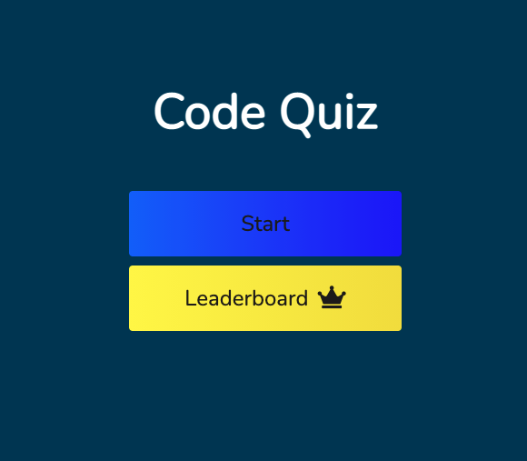
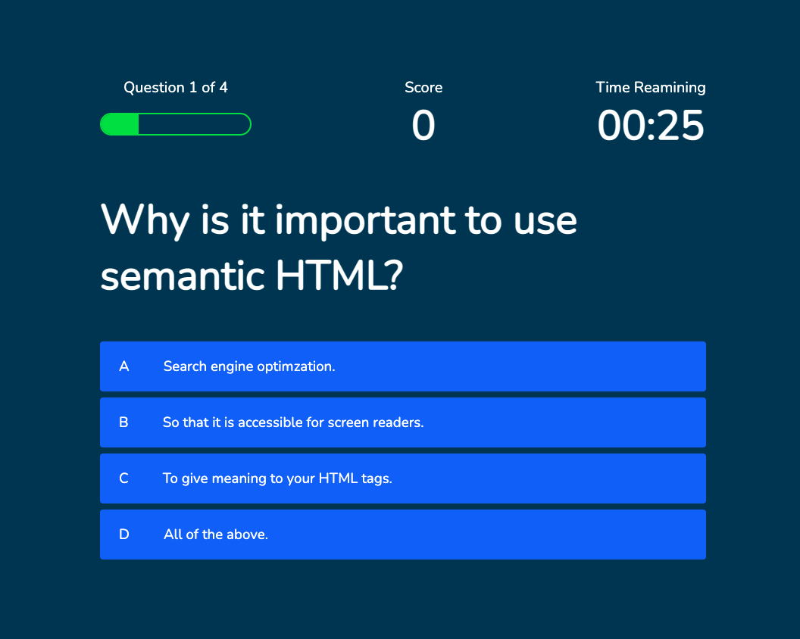
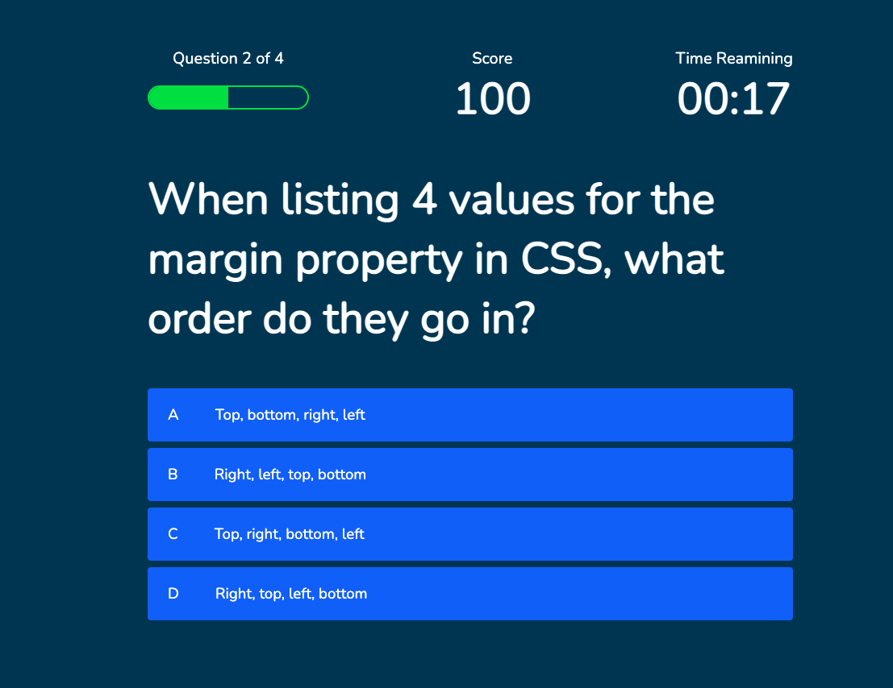
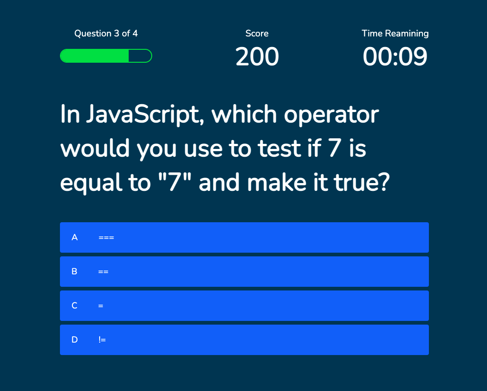
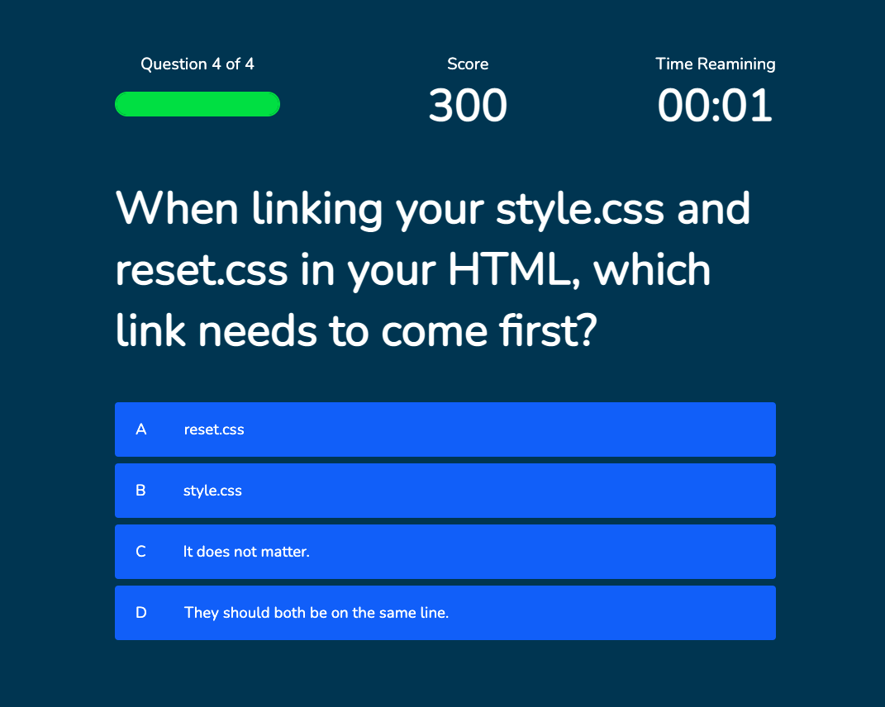
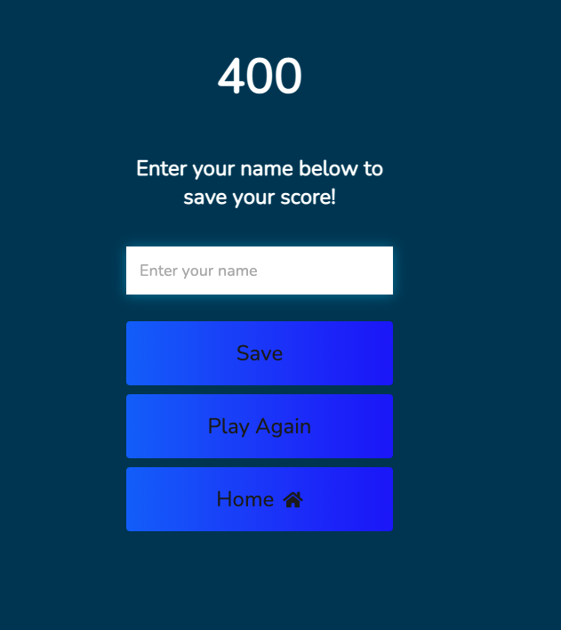
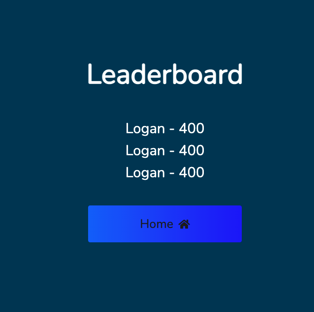

# OSU Bootcamp Homework 4

## Summary

In order to get the window to change for each section I used four different HTML files. The first one is the home screen where you can either start the quiz or view the leaderboard. The next screen starts the quiz and the timer. There are four questions. After each question is answered you will get the box to light up green or red, depending on if you got the answer correct. There is then a 1 second delay and the next question is displayed. The quiz also keeps score. There are 100 points per correct answer. Your progress is also tracked, displaying how many questions you've answered and how many remain. There are only 30 seconds to complete the quiz. If time runs out, you are returned to the home screen. Once you complete the final question, you are taken to an ending page where your score is displyed. There is then a form to enter your name and you click save to save it to the leaderboard. There are then buttons where you can take the quiz again or you can return to the home screen. On the leaderboard page, the highest scores are displayed and there is a button to return to the home screen.

---

## Challenges

The hardest part of this project for me was figuring out how to keep score and save them to the leaderboard. I was able to get them to save to local storage, but then I couldn't get them to diplay. It was also a big challenge for me to figure out the timer. I was never able to figure out how to get the time to decrease with an incorrect answer. There was also a small bug in my code and once I found it, it started keeping time. However, I could not get the quiz to end when time ran out. I finally found `window.location.assign()` on MDN and was able to the game to end and return to the home screen with this if statement:

```
{
    if(time <= 0 || time < 1){
        endTime();
        clearInterval(countDown);
        window.location.assign('index.html');
    }
}
```

---

## Something New That I learned

The best new thing that I learned was how to get the quiz to track progress and display a progress bar. With these lines I was able to keep track of the number of questions and add it to the inner text and I was able to add 25% to the green bar.

```
{
     questionCounter++
    progressText.innerText = `Question ${questionCounter} of ${MAX_QUESTIONS}`
    progressBarFull.style.width = `${(questionCounter/MAX_QUESTIONS) * 100}%`

}
```

---

## Screen Shots















---

## Link to Deployed Application

[Link to deployed application]()
